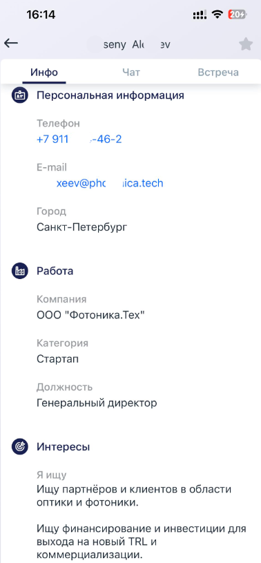
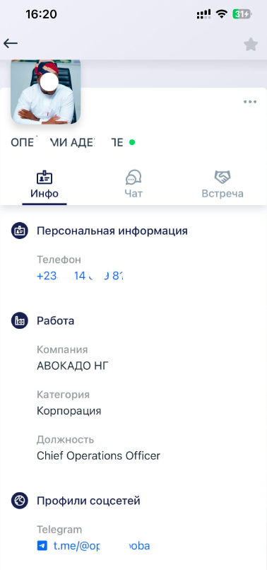

# Описание проекта

Скрипт предназначен для автоматического извлечения текстовых данных с **анкет участников хакатона**.  
На вход подаются фотографии анкет, на выходе формируется **структурированный DataFrame**, который затем сохраняется в **CSV и XLSX** форматах.

## Используемые технологии

Проект использует две разные технологии OCR, каждая из которых закрывает свою задачу:

### EasyOCR  
Используется для распознавания **основного текста** анкеты — ФИО, категории, должности, контактов и т.д.  
Покрывает большинство полей, устойчиво работает на разных фото.

### TrOcr (Transformer OCR)  
Используется исключительно для распознавания **ссылок (URL)**.  
Причина использования — ссылки часто искажены, мелкие, содержат символы, которые обычный OCR распознаёт хуже.  
TrOcr даёт значительно более стабильный результат для таких случаев.
## Пример фотографий 

  

## Итог работы

После обработки всех изображений формируется единый **pandas DataFrame**, в котором:

- каждая строка соответствует **одной уникальной анкете**  
- если анкета состоит из нескольких страниц, они корректно объединяются  
- для каждой строки сохраняется список имён файлов, из которых была собрана анкета  
- все текстовые поля агрегируются и очищаются

Было обработано около 5500 фотографий, из которых получилось более 4000 записей. Полученные данные не публикуются для сохранения конфиденциальности.

## Структура итогового DataFrame

Обработанные данные из анкет участников сохраняются в виде pandas DataFrame и экспортируются в CSV и Excel файлы. Ниже приведено описание каждой колонки:

| Название колонки        | Описание |
|------------------------|----------|
| **ФИО**               | Полное имя участника (имя и фамилия). |
| **Телефон**           | Контактный номер телефона. |
| **E-mail**            | Адрес электронной почты. |
| **Город**             | Город проживания. |
| **Компания**          | Компания или организация, которую представляет участник. |
| **Категория**         | Тип компании или проекта (например, Стартап, Корпоративный проект). |
| **Должность**         | Должность или роль в компании. |
| **Я ищу**             | Что ищет участник (например, партнёров, инвесторов). |
| **Я полезен**         | Навыки или области, где участник может быть полезен другим. |
| **О себе**            | Краткая личная информация или описание. |
| **Профили соцсетей**  | Исходный текст с профилями в соцсетях. |
| **Telegram**          | Обработанный Telegram-аккаунт. |
| **Вконтакте**         | Обработанный аккаунт ВКонтакте. |
| **Name file**         | Название(я) файлов изображений, из которых была извлечена информация. |
z

